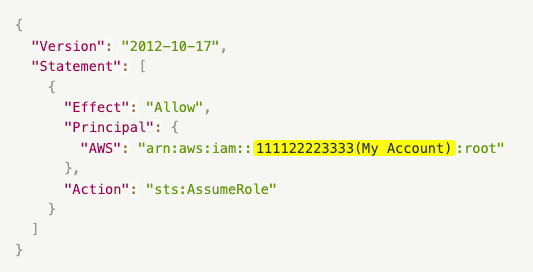
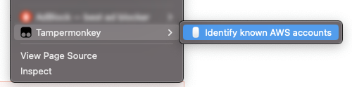

# AWS Identify Known Accounts

A simple [Tampermonkey][tm] script which will find AWS account ids on the current web page and highlights them with their account name.

I was motivated to create this script as it's often difficult identifying accounts by their account id alone, especially when reading pull-requests etc.



## Installation

1. Install the [Tampermonkey][tm] extension in your browser.
2. Create a new script and copy-paste the contents of [identify-known-aws-accounts.user.js](./identify-known-aws-accounts.user.js) into it.
3. Edit the script with your AWS accounts (see below).
4. Save the script.

### Configuration

You must edit the `ACCOUNTS` constant to contain a list of your AWS accounts.

Each object MUST contain `accountId` and `accountName`. Note, `accountId` is a regular expression *not* a string.

It's also possible to override `DEFAULT_BACKGROUND_COLOR` and `DEFAULT_TEXT_COLOR` of individual accounts by setting `backgroundColor` and `textColor` respectively.
For example, you may wish to style production accounts differently than non-production accounts etc.

```javascript
  const ACCOUNTS = [
    {
      accountId: /999999999991/,
      accountName: "Acme Inc - Development",
    },
    {
      accountId: /999999999992/,
      accountName: "Acme Inc - Staging",
    },
    {
      accountId: /999999999993/,
      accountName: "Acme Inc - Production",
      backgroundColor: 'pink', // Optional
      textColor: 'black', // Optional
    },
  ];
```

## Usage

Simply right-click on any web-page, select **Tampermonkey** then click **Identify known AWS accounts**.



[tm]: https://www.tampermonkey.net/